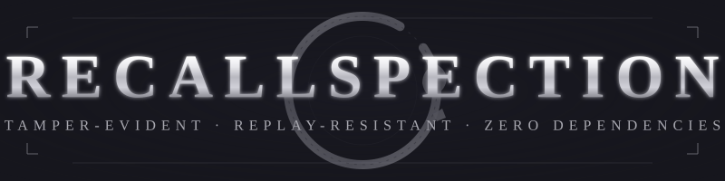

<p align="center">
  
</p>

<p align="center">
  
  
  
  
</p>

<h1 align="center">Powered by Sciencedelic Metatech</h1>

<p align="center">
  <strong>A tamper-evident, replay-resistant, key-rotatable key-value store with zero external dependencies.</strong>
</p>

<p align="center">
  Part of the <a href="https://github.com/sciencedelicmetatech/recallspection">Recallspection</a> project.
</p>

---

## Why ExactMemory-Recallspection?

AI agents, audit systems, and compliance pipelines all need one thing that most storage layers do not provide: **proof that stored data has not been modified**. A plain database returns whatever bytes are on disk. A vector store returns the nearest neighbour, whether or not it is authentic. A cache silently serves stale content.

ExactMemory answers a different question: **"Is this record still exactly what was written?"**

Every record is sealed with an HMAC-SHA256 tag, bound to a monotonic version counter and an optional freshness window. If a single byte changes anywhere in the record either payload, header, or metadata, the store refuses to return it. If someone tries to replay an older valid record, the version check rejects it. If a key is rotated, old records remain verifiable under their original key ID.

The library is **pure Python standard library**. It runs on Linux, macOS, Windows, and iOS. No PyTorch. No NumPy. No native extensions.

---

## Features

| Feature | Description |
|---------|-------------|
| **HMAC-SHA256 integrity** | 16-byte authentication tag over the full record |
| **Metadata binding** | The tag covers `key_id`, `version`, `timestamp`, and `nonce` — not just the payload |
| **Replay resistance** | Monotonic version counter + timestamp + optional TTL |
| **Key rotation** | `rotate_key()` adds a new key without invalidating existing records |
| **Substitution resistance** | Records are bound to the SHA3-256 digest of their key |
| **Zero dependencies** | Pure Python 3.8+ standard library |
| **Persistence** | Human-readable JSON, backward-compatible loader |
| **Tiny footprint** | < 300 lines of code, < 15 KB installed |

---

## Installation

```bash
pip install exactmemory-recallspection
